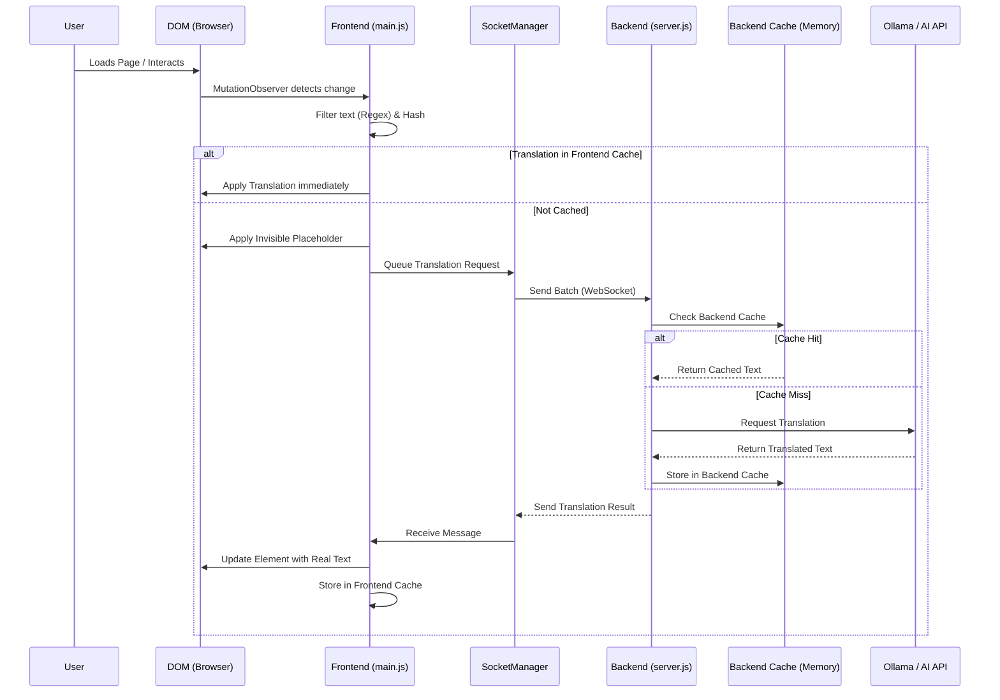

# Mie Ollama Translate

**An Open-Source, Privacy-Focused Alternative to Google Translate for Web Applications.**

This framework provides a high-performance, self-hosted translation layer for your web applications. It uses a lightweight frontend script to detect text and a Node.js backend to process translations via **Ollama (Local LLMs)** or external APIs like BlueHive.

## 🚀 Why Use This?

- **Open Source & Private**: Run translations locally using Ollama. No data leaves your infrastructure.
- **Dynamic Content**: Automatically translates new content added to the page (Modals, SPAs) using `MutationObserver`.
- **Smart Caching**: Two-layer caching (Frontend RAM + Backend Memory) ensures instant translations for repeated text.
- **Healthcare/Domain Specific**: Customizable prompts allow you to tune translations for specific domains (e.g., Medical EHR).

## 🛠️ Setup Guide

### 1. Backend Setup (The Translation Engine)

The backend handles the heavy lifting: queuing requests and talking to the AI.

1.  **Navigate to the backend folder:**
    ```bash
    cd backend
    ```

2.  **Install dependencies:**
    ```bash
    npm install
    ```

3.  **Configure Environment:**
    Create a `.env` file in the `backend` folder:
    ```env
    # Choose Provider: 'ollama' (Local) or 'bluehive' (Cloud)
    TRANSLATION_PROVIDER=ollama
    
    # If using Ollama:
    OLLAMA_MODEL=llama3.2
    
    # If using BlueHive/External API:
    BLUEHIVE_API_KEY=your_key_here
    ```

4.  **Start the Server:**
    ```bash
    npm start
    ```
    *Runs on `ws://localhost:8080`*

### 2. Frontend Integration (The Client Script)

Simply include the `main.js` script in your HTML file. It will automatically connect to the backend and start translating.

```html
<!-- Add this to the bottom of your <body> -->
<script src="path/to/frontend/main.js"></script>
```

That's it! The script will:
1.  Scan the page for text.
2.  Ignore numbers, dates, and codes.
3.  Send text to your backend.
4.  Update the DOM with translations automatically.

## 🔄 How It Works



## 🎮 Public API

You can control the system manually via the browser console:

- `window.translationSystem.setLanguage('es')` - Switch target language.
- `window.translationSystem.getStats()` - View cache and queue statistics.
- `window.translationSystem.rescan()` - Manually trigger a page scan.
- `window.translationSystem.stop()` - Pause the observer.

## 📂 Project Structure

- `frontend/main.js`: The client-side "brain". Handles DOM manipulation and WebSockets.
- `backend/server.js`: The server-side "muscle". Manages queues, caching, and AI connections.
- `examples/`: Sample HTML pages to test the system.
