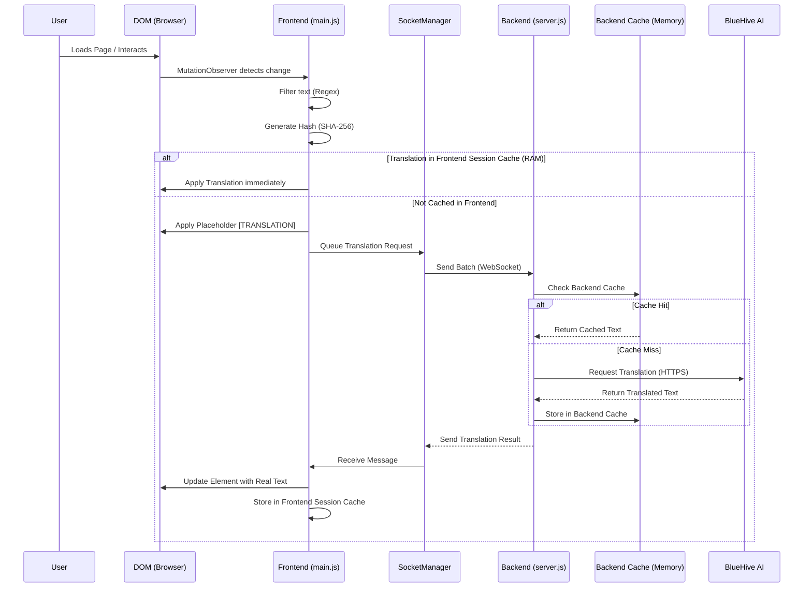

# Mie Ollama Translate

A high-performance, client-side JavaScript translation framework designed to handle dynamic content efficiently. This system automatically scans the DOM, identifies translatable text, and applies translations while maintaining performance through caching and batch processing.

## Features

- **🚀 High Performance**: Implements debouncing, batch processing, and caching to minimize DOM manipulation overhead.
- **🔄 Dynamic Content Support**: Uses `MutationObserver` to automatically detect and translate new content added to the page.
- **💾 Smart Caching**: Uses SHA-256 hashing to cache text and translations, preventing redundant processing.
- **🛡️ Intelligent Validation**: Automatically skips non-translatable content such as:
  - Numbers, dates, and times
  - URLs and emails
  - Codes and IDs
  - File extensions
- **🔌 Extensible API**: Provides a global `window.translationSystem` object for manual control and custom translation injection.

## Installation

Simply include the `main.js` script in your HTML file. If you are using the provided folder structure, it is located in the `frontend` directory:

```html
<script src="frontend/main.js"></script>
```

## Project Structure

- `frontend/`: Contains the core client-side translation script (`main.js`).
- `backend/`: Node.js WebSocket server to receive translation requests.
- `examples/`: Contains example implementations, such as an EHR dashboard.

## Usage

### 1. Start the Backend
Navigate to the `backend` directory and install dependencies:
```bash
cd backend
npm install
npm start
```
The server will start on `ws://localhost:8080`.

### 2. Open the Example
Open `examples/ehr-dashboard.html` in your browser. The script will automatically connect to the backend and start sending discovered text for translation.

### Public API

The system automatically initializes when the DOM is ready. It will perform an initial scan of the page and start observing for changes.

### Default Behavior
Currently, the system simulates translation by prepending `[TRANSLATION] ` to the text. This serves as a placeholder for integrating with a real translation backend (like Ollama).

## System Architecture

The following diagram illustrates the end-to-end translation process:



## Configuration

The script includes a `CONFIG` object at the top that can be modified to tune performance:

```javascript
const CONFIG = {
  TRANSLATION_PREFIX: '[TRANSLATION] ',
  DEBOUNCE_DELAY: 100, // ms to wait before processing mutations
  BATCH_SIZE: 50,      // Process mutations in batches
  CACHE_SIZE: 1000,    // Maximum cache entries
  MIN_TEXT_LENGTH: 2   // Minimum text length to translate
};
```

## How It Works

1.  **Scanning**: The system walks the DOM tree to find text nodes and translatable attributes (placeholder, value, alt, title).
2.  **Validation**: Each text item is checked against a set of regex patterns to ensure it's actual content and not code, numbers, or metadata.
3.  **Hashing**: Valid text is hashed using SHA-256 to create a unique identifier.
4.  **Translation**: The text is "translated" (currently mocked) and cached.
5.  **Observation**: A `MutationObserver` watches for DOM changes and repeats the process for new elements.
